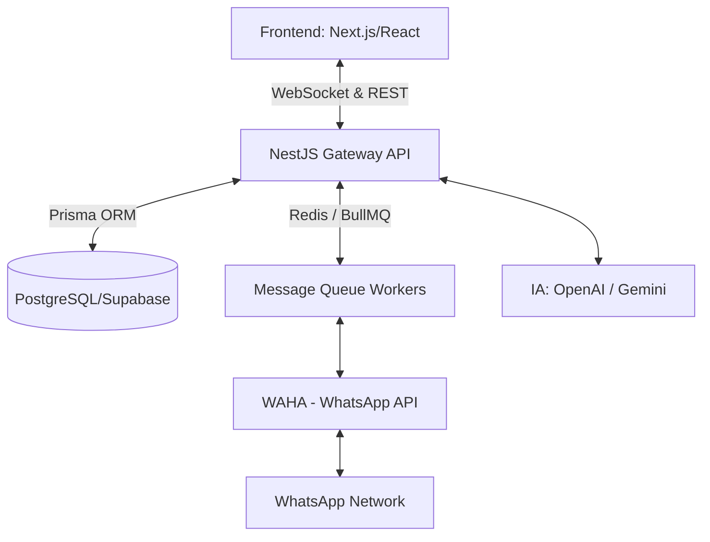

# Projeto Executivo - ZapFunil CRM

## 1. Visão Geral da Arquitetura

A arquitetura do ZapFunil CRM foi projetada para alta disponibilidade, processamento em tempo real e escalabilidade, suportando múltiplos atendentes e volume intensivo de mensagens.



## 2. Tecnologias
- **Frontend**: Next.js 15, React 19, TypeScript, Tailwind CSS, Shadcn UI, Zustand (Estado), Socket.io-client.
- **Backend**: NestJS, TypeScript, JWT, Socket.io.
- **Database**: PostgreSQL (hospedado no Supabase), Prisma ORM.
- **Fila/Cache**: Redis + BullMQ (para disparo em lote, webhooks do WAHA).
- **Core WhatsApp**: WAHA (WhatsApp HTTP API).

## 3. Estrutura de Pastas (Monorepo / Frontend + Backend Mapeado)

```
/
├── prisma/
│   └── schema.prisma         # Modelagem completa do banco de dados
├── src/
│   ├── components/           # Componentes UI (Shadcn + App)
│   │   ├── Chat/             # Módulo de atendimento (WhatsApp)
│   │   ├── Kanban/           # Módulo de CRM
│   │   └── Dashboard/        # Módulo Analítico
│   ├── store/                # Estado global (Zustand)
│   ├── lib/                  # Utilitários (Socket, Formatação)
│   ├── pages/                # Telas (Next.js App Router style)
│   └── types.ts              # Definições TS estritas
├── server.ts                 # Ponto de entrada do backend API/WebSocket
└── package.json
```

## 4. Plano de Implementação em Etapas

### Fase 1: MVP Estrutural (Atual)
- [x] Configurar ambiente Vite/React + Express + WebSocket.
- [x] Construir interface base (Sidebar).
- [x] Implementar Chat UI (Lista, Conversa e Ficha de CRM).
- [x] Implementar Funil Kanban (Drag and drop).
- [x] Implementar Dashboard UI.
- [x] Desenvolver schema Prisma completo.

### Fase 2: Integração Backend (NestJS + Supabase)
- [ ] Subir DB PostgreSQL no Supabase.
- [ ] Rodar `prisma migrate` e gerar client.
- [ ] Configurar rotas REST com JWT Auth.
- [ ] Acoplar Zustand para puxar dados da API.

### Fase 3: Integração WAHA
- [ ] Subir container Docker do WAHA.
- [ ] Configurar Webhooks para recebimento de mensagem via BullMQ.
- [ ] Salvar mensagens no Postgres via Prisma.
- [ ] Notificar frontend via Socket.IO.

### Fase 4: Automação e IA
- [ ] Módulo de transcrição chamando Whisper/Gemini API quando payload é áudio.
- [ ] Resumo de conversas ao fechar ticket.
- [ ] Cron Jobs (BullMQ) para processar Agendamento de Mensagens.

## 5. Fluxos de Negócio (Exemplo: Recebimento de Mensagem)
1. Cliente envia mensagem no WhatsApp.
2. WAHA recebe e dispara Webhook para o Backend (NestJS).
3. Backend enfia payload no Redis (BullMQ) para não gargalar rotas.
4. Worker lê a fila, verifica ou cria Contato/Conversa no Prisma, salva a Mensagem.
5. Emite evento Socket.IO `new_message` para a sessão daquele número.
6. Frontend recebe no estado Zustand e atualiza UI, tocando notificação. Se áudio, transcreve paralelamente.
